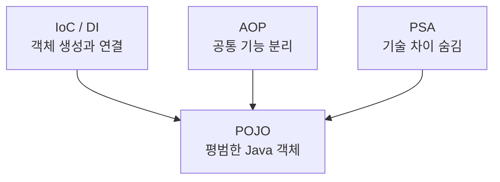
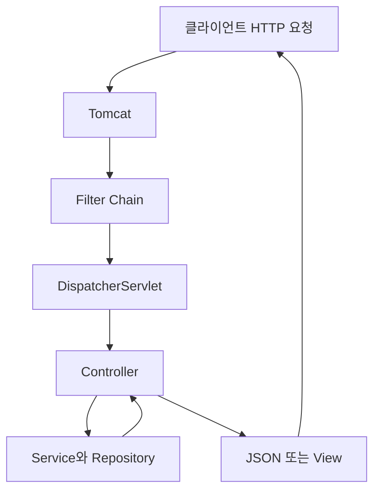

# 1. spring-tutorial-24th


## 2. spring이 지원하는 기술들

### 1 . POJO 란?

**POJO :** Plain Old Java Project , 즉 순수한 오래된 자바 객체

```java
public class User {
    private String name;
    private int age;

    public User(String name, int age) {
        this.name = name;
        this.age = age;
    }

    public String getName() {
        return name;
    }
}

```

- 특정 클래스를 상속하거나 특별한 인터페이스를 구현하지 않아도 됨 .

= Java나 Java의 스펙에 정의된 것 이외에는 다른 기술에 얽매이지 않아야 함 .

- Service 와 같은 클래스들도 기본적으로 어노테이션으로 관리함

```java
@Service
public class OrderService {

    @Transactional
    public void createOrder() {
        System.out.println("주문 생성");
    }
}

```

= 즉 ,비즈니스 로직이 프레임워크에 과하게 의존하지 않도록 만드는 것이 POJO 방식의 핵심 .

---

#### POJO 이전의 방식

→ EJB ( Enterprise Java Beans ) 로 개발 .

- EJB  컨테이너의 역할 :

→ 트랜잭션 관리 ,보안, 동시성 처리 등을 대신 처리해줌 .

**BUT )) 개발자가 비즈니스 객체를 만들 때 EJB가 정한 규칙을 반드시 따랐어야 했음**

#### EJB의 문제점

- 특정 인터페이스와 클래스를 구현해야 함
- EJB 컨테이너 없이는 실행과 테스트가 어려움
- 코드가 EJB 기술에 강하게 의존함
- 작은 기능을 개발하기에도 구조가 무거움

⇒ 이 문제점들을 타파하기 위해 Spring은 **POJO로 객체를 평범하게 작성한 뒤 필요한 기능을 컨테이너가 붙여주는 방식을 사용 !!**

---

#### POJO의 장점 및 조건

- 조건
    - 특정 클래스를 상속 X
    - 특정 인터페이스를 강제로 구현하지 않음
    - 특정 어노테이션에 과도하게 의존하지 않는다 .
- 장점
    - 프레임워크 의존성이 낮다 .
    - 코드가 단순하다 . ( 불필요한 상속이나 구현 메서드 없이 비즈니스 로직에 집중할 수 있음. )
    - 테스트 하기 쉬움 ( 객체 직접 생성해서 단위 테스트 할 수 있음 )
    - 유지보수가 쉬움
    - 객체 지향 설계에 유리
- POJO 인 경우

```java
public class OrderService {

    public void createOrder() {
        System.out.println("주문을 생성합니다.");
    }
}

```

- POJO 가 아닌 경우

```text
public class OrderServiceBean implements SessionBean {

    public void createOrder() {
        System.out.println("주문을 생성합니다.");
    }

```

---

### 2. Spring 삼각형


**Spring이 POJO 개발을 가능하게 만드는 세 가지 핵심 기술**



즉 , Spring의 핵심 = **평범한 Java 객체인 POJO를 유지하면서도 DI, AOP, PSA를 통해 엔터프라이즈 기능을 사용할 수 있게 하는 것**

#### 1 ) IoC/ DI : 객체의 생성과 연결을 Spring이 담당

- **IoC(제어의 역전)**: 객체 생성과 관리의 주도권이 개발자에서 Spring으로 넘어감

⇒ 설계 원칙 : 외부에 객체의 생성/소멸 맡김

- **DI(의존성 주입)**: Spring이 필요한 객체를 외부에서 넣어줌

⇒ 디자인 패턴 / 구현 받음 ( 필요한 객체를 외부에서 주입받음 )

---

**IoC : 제어의 역전**

객체의 생성/ 흐름 제어 권한을 **개발자가 아닌 외부 시스템 ( 프레임워크 , 컨테이너 )** 에 위임하는 방식

- 기존

```java
public class OrderService {

private final OrderRepository orderRepository
				= new MyOrderRepository();
				
}

```

→ OrderService가 MyOrderRepository를 직접 생성하기 때문에 두 클래스가 강하게 결합됨 .

**⇒ cf ))  이 코드는 왜 단위 테스트가 어려운가 ?**

: 단위테스트에서는 보통 실제 DB 대신 가짜 객체를 사용함 .

**문제점 : 변경에 열려 있고 확장에 닫혀 있다 ( OCP에 위배됨 )**

→ 즉 , 개발자가 직접 객체를 생성하거나 소멸시키면 메모리 낭비도 생김.

그러므로 객체의 생명주기 관리를 외부에 위임.

- Spring

```text
@Service 
public class OrderService 
{

private final OrderRepository orderRepository;

public OrderService(OrderRepository orderRepository)
{
this.orderRepository= orderRepository;

}


```

⇒ 결합도가 낮아져 구현체 교체와 생명주기 관리가 편리해짐 .

---

**Spring Container의 역할**

→ 객체의 제어권을 가짐 !

`🌟Bean` : Spring 이 관리하는 객체

```text
개발자: 어떤 객체를 사용할지 설정
Spring Container: 객체 생성 → 의존관계 연결 → 관리 → 소멸

```

**1 ) 객체 생성**

```java
@Repository
public class MyOrderRepository {
}

```

→ `@Service` 등과 같은 어노테이션이 붙은 클래스를 객체로 생성함 .

**2 ) 객체 사이의 의존관계를 연결**

```java
@Service
public class OrderService {

    private final OrderRepository repository;

    public OrderService(OrderRepository repository) {
        this.repository = repository;
    }
}

```

`OrderService`에는 `OrderRepository`가 필요!!

Spring Container는 자신이 관리하는 Bean 중에서 알맞은 객체를 찾아 생성자에 넣어줌.

```
Spring Container
├── MyOrderRepository Bean 생성
└── OrderService Bean 생성
          └── MySqlOrderRepository Bean 주입

```

이것이 **DI(의존성 주입) !!**

**3 ) 객체의 생명주기 관리**

```text
Spring 실행
→ Bean 생성
→ 의존성 주입
→ 초기화
→ Bean 사용
→ Spring 종료
→ Bean 소멸

```

→ 개발자가 매번 직접 객체를 생성하거나 제거하지 않아도 됨.

**4 ) 객체의 범위를 관리**

→ **싱글톤**이 기본 ! ( 컨테이너 하나당 하나의 객체만 생성함 → 여러 곳에서 공유 )

**Spring Container의 종류**

대표적으로 두 가지 인터페이스가 있음.

| 종류                   | 역할                                        |
| -------------------- | ----------------------------------------- |
| `BeanFactory`        | Bean 생성과 DI 등 기본 기능 제공                    |
| `ApplicationContext` | `BeanFactory` 기능 + 이벤트, 메시지, 환경설정 등 추가 기능 |

실제 Spring 애플리케이션에서는 대부분 `ApplicationContext`를 Spring Container로 사용 !!

```text
ApplicationContext context=
new AnnotationConfigApplicationContext(AppConfig.class); 

```

Spring Boot에서는 다음 코드가 실행될 때 `ApplicationContext`가 자동으로 만들어짐.

```text
SpringApplication.run(Application.class,args);

```

---

**IoC, DI와의 관계**

- **IoC**: 객체의 생성·관리 권한을 개발자가 아니라 Spring Container가 가지는 설계 원칙
- **DI**: Spring Container가 필요한 객체를 외부에서 넣어주는 구현 방법
- **Spring Container**: IoC와 DI를 실제로 수행하는 주체
- **Bean**: Spring Container가 생성하고 관리하는 객체

#### 3. 의존성 주입 방식 (DI)

→ 제어의 역전 방법 중 하나로 , 외부 컨테이너가 생성한 객체를 주입받아서 사용하는 방식

**1. 생성자 주입 — 🌟🌟🌟가장 권장**

```java
@Service
public class OrderService {

    private final OrderRepository repository;

    public OrderService(OrderRepository repository) {
        this.repository = repository;
    }
}

```

- **특징:** 객체를 생성할 때 생성자로 의존성을 주입한다.
- **장점:** `final`을 사용할 수 있고, 의존성 누락을 방지하며 단위 테스트가 쉽다.

---

**2. Setter 주입**

```java
@Service
public class OrderService {

    private OrderRepository repository;

    @Autowired
    public void setRepository(OrderRepository repository) {
        this.repository = repository;
    }
}

```

- **특징:** 객체를 먼저 생성한 후 Setter로 의존성을 주입한다.
- **장점:** 객체 생성 이후에도 의존성을 변경하거나 선택적으로 주입할 수 있다.

---

**3. 필드 주입**

```java
@Service
public class OrderService {

    @Autowired
    private OrderRepository repository;
}

```

- **특징:** Spring이 필드에 직접 의존성을 주입한다.
- **장점:** 코드가 짧고 간단하다.
- **단점:** `final`을 사용할 수 없고, Spring 없이 단위 테스트하기 어렵다.

| 방식              | 핵심 특징    | 핵심 장점                |
| --------------- | --------- | -------------------- |
| 생성자 주입          | 생성할 때 주입  | 불변성·필수 의존성·보장·테스트 용이 |
| Setter 주입       | 생성한 후 주입  | 의존성 변경 및 선택적 주입 가능   |
| 필드 주입           | 필드에 직접 주입 | 코드가 간단함              |

**결론: 특별한 이유가 없다면 생성자 주입을 사용하면 된다.**

---

#### cf ) 생성자로 의존성을 주입받는 방법 : 추가 예시

```java
@Component
public class Car {

    private final Tire tire;

    public Car(Tire tire) {
        this.tire = tire;
    }

    public void drive() {
        tire.roll();
    }
}

```

##### 1. 필수 의존성 보장

`Tire` 없이는 `Car`를 생성할 수 없다.

```text
new Car();               // 컴파일 오류
new Car(new KoreaTire()); // 정상

```

##### 2. 불변성 보장

`final`을 사용하므로 객체 생성 이후면 주입받은 `Tire`를 변경할 수 없다.

```text
private final Tire tire;

```

##### 3. 순환 참조를 빠르게 발견

```java
class Car {
    Car(Driver driver) {}
}

class Driver {
    Driver(Car car) {}
}

```

`Car`와 `Driver`가 서로를 필요로 하므로 Spring이 객체를 생성할 수 없다. 따라서 애플리케이션 시작 시점에 잘못된 의존관계를 발견할 수 있다.

##### 4. POJO 단위 테스트가 쉬움

Spring을 실행하지 않고 Mock 객체를 직접 주입할 수 있다.

```text
@Test
void 자동차_주행_테스트() {
    Tire mockTire = mock(Tire.class);
    Car car = new Car(mockTire);

    car.drive();

    verify(mockTire).roll();
}

```

**핵심:** 생성자 주입은 의존성 누락과 변경을 방지하고, 순환 참조를 빠르게 발견하며, Mock을 사용한 단위 테스트를 쉽게 만든다.

**++ )) 개발 편의성을 위해 라이브러리로 롬복 사용 !! 🌟🌟**

(`@RequiredArgsConstructor` + `final` 조합)

```java
@RequiredArgsConstructor
public class Car {
	private final Tire tire;
}

```

---

### **3. AOP**

**Aspect - Oriented Programming ( 관점 지향 프로그래밍 )**

⇒ 여러 클래스에 반복되는 **공통 기능을 핵심 비즈니스 로직에서 분리하는 프로그래밍 방식**

- **관점이란 ?**

어떤 기능을 구현할 때 , 그 기능을 핵심 / 부가 기능으로 구분해서 각각을 하나의 관점으로 보는 것을 말함 .

#### AOP의 주요 용어

| 용어       | 의미                            |
| ---------- | ----------------------------- |
| Aspect     | 공통 기능을 모아놓은 클래스               |
| Advice     | 실제로 수행할 공통 기능                 |
| Pointcut   | 공통 기능을 적용할 대상 지정              |
| Join Point | 공통 기능을 적용할 수 있는 지점            |
| Target     | 실제 비즈니스 로직을 가진 객체             |
| Proxy      | Target 앞에서 AOP 기능을 실행하는 대리 객체 |

#### Advice의 종류

| 어노테이션          | 실행 시점        |
| ----------------- | ------------- |
| `@Before`         | 메서드 실행 전      |
| `@After`          | 메서드 실행 후      |
| `@AfterReturning` | 메서드가 정상 종료된 후 |
| `@AfterThrowing`  | 예외 발생 후       |
| `@Around`         | 메서드 실행 전후     |

#### AOP를 사용하지 않은 경우

```text
public void createOrder() {
    long start = System.currentTimeMillis();

    // 핵심 기능
    System.out.println("주문 생성");

    long end = System.currentTimeMillis();
    System.out.println("실행 시간: " + (end - start));
}

```

```text
public void pay() {
    long start = System.currentTimeMillis();

    // 핵심 기능
    System.out.println("결제 처리");

    long end = System.currentTimeMillis();
    System.out.println("실행 시간: " + (end - start));
}

```

실행 시간 측정 코드가 모든 메서드에 반복되고, 핵심 로직과 부가 기능이 섞임.

#### AOP를 적용한 경우

비즈니스 로직에는 핵심 기능만!!

```
@Service
public class OrderService {

    public void createOrder() {
        System.out.println("주문 생성");
    }
}

```

실행 시간 측정은 별도의 클래스에서 처리

```
@Aspect //Aspect = 공통 기능 클래스
@Component
public class TimeTraceAspect {

    //Advice = 실제로 수행할 공통 기능 
    @Around(
    "execution(* com.example..*(..))"
    //PointCut = 공통 기능 적용 대상 지정 
    )

    public Object measureTime(ProceedingJoinPoint joinPoint)
            throws Throwable {

        long start = System.currentTimeMillis();

        try {
            return joinPoint.proceed(); // 실제 Target 메서드 실행
        } finally {
            long end = System.currentTimeMillis();
            System.out.println("실행 시간: " + (end - start));
        }
    }
}

```

< 실행 순서 >

```text
프록시가 요청을 받음
→ AOP의 실행 시간 측정 시작
→ 실제 createOrder() 실행
→ AOP의 실행 시간 측정 종료

```

#### Spring AOP의 동작 원리

→ 실제 객체 앞에 **프록시 객체**를 만들어둠 .

```text
호출자
  ↓
Proxy 객체
  ├── 공통 기능 실행
  ├── 실제 객체의 메서드 실행
  └── 공통 기능 마무리

```

실제로는 이렇게 동작하게 됨 .

```
public void createOrder() {
    startTransaction();

    try {
        realOrderService.createOrder();
        commit();
    } catch (Exception e) {
        rollback();
    }
}

```

개발자가 이 코드를 직접 작성하지 않아도 Spring이 프록시를 통해 앞뒤에 붙여준다.

**대표적인 AOP 활용:** **`@Transactional`**

**AOP를 사용하는 기능**

- 트랜잭션 관리
- 로그 기록
- 실행 시간 측정
- 보안 및 권한 검사
- 예외 처리
- 모니터링

**AOP의 장점**

- 공통 코드의 중복을 줄일 수 있다.
- 비즈니스 로직과 부가 기능을 분리할 수 있다.
- 공통 기능을 한 곳에서 수정할 수 있다.
- 핵심 로직의 가독성과 유지보수성이 좋아진다.

**cf ) OOP와 AOP의 차이**

**Object-Oriented Programming, 객체 지향 프로그래밍)**

=프로그램을 여러 개의 **객체**로 나누고, 객체들이 서로 협력하도록 만드는 프로그래밍 방식

**핵심 비유 :**

- **OOP:** 업무를 주문팀, 결제팀, 회원팀으로 나눈다.
- **AOP:** 모든 팀에 필요한 출퇴근 기록이나 보안 검사를 별도 관리팀이 담당한다.

| 구분          | OOP             | AOP            |
| ----------- | --------------- | -------------- |
| 기준          | 역할과 책임          | 공통 관심사         |
| 나누는 대상      | 주문·결제·회원 등의 객체  | 로그·트랜잭션·보안 등   |
| 목적          | 핵심 기능을 객체별로 분리  | 중복되는 부가 기능을 분리 |
| 관계          | 프로그램의 기본 구조를 설계 | OOP의 중복 문제를 보완 |

**한 줄 정리:**

AOP는 로깅·트랜잭션처럼 여러 곳에서 반복되는 공통 기능을 별도로 분리하고, Spring 프록시가 실제 메서드 실행 전후에 그 기능을 적용하는 방식 !!

---

### PSA ( Portable Service Abstraction )

→ 하나의 추상화로 여러 서비스를 묶어둔 것 .

즉, 내부 기술이 달라져도 개발자가 사용하는 방법은 같게 만들어주는 것

**대표 예시:** **`@Transactional`**

DBC와 JPA는 내부 트랜잭션 처리 방식이 다름.

#### JDBC 방식

```
Connection connection = dataSource.getConnection();

try {
    connection.setAutoCommit(false);

    // 비즈니스 로직 실행

    connection.commit();
} catch (Exception e) {
    connection.rollback();
}

```

#### Spring PSA 사용

```
@Transactional
public void createOrder() {
    orderRepository.save(order);
}

```

BUT 개발자는 JDBC를 사용하든 JPA를 사용하든 동일하게 `@Transactional`만 사용하면 됨 !!

```text
개발자
  ↓
@Transactional
  ↓
Spring의 트랜잭션 추상화
  ↓
JDBC / JPA / Hibernate에 맞는 실제 처리

```

⇒ Spring이 내부에서 사용하는 기술에 맞는 트랜잭션 관리자를 선택해서 처리해줌.

#### PSA의 장점

- 기술마다 다른 사용법을 모두 알지 않아도 된다.
- 내부 기술이 변경되어도 비즈니스 코드의 변경이 적다.
- 특정 기술에 대한 의존성이 낮아진다.
- 코드를 일관된 방식으로 작성할 수 있다.

### 3. Spring Bean

#### 1. 스프링 빈 이란 ?

→  Spring Container가 생성하고 관리하는 Java 객체 ( 즉 , IoC 컨테이너가 생성함 )

→ 클래스 위에 `@Component` 또는 설정 클래스 메서드에 `@Bean` 을 선언함

#### 2. 스프링 빈 라이프사이클

→ 생성 및 소멸 과정

```text
Bean 정보 등록 ( Bean Definition 등록 )
→ 객체 생성
→ 의존성 주입
→ 초기화
→ 사용
→ 소멸

```

#### ① BeanDefinition 등록

Spring이 어떤 클래스를 Bean으로 생성할지에 대한 설계 정보를 등록한다.

```
Bean 이름: orderService
Bean 클래스: OrderService
Scope: singleton
Lazy 여부: false

```

→ 아직 실제 객체가 만들어진 것이 아님 !

#### ② 객체 생성

BeanDefinition을 바탕으로 실제 객체를 생성한다.

```
new OrderService();

```

#### ③ 의존성 주입

생성자, Setter, 필드 등을 통해 필요한 Bean을 주입한다.

```
new OrderService(orderRepository);

```

#### ④ 초기화

의존성 주입이 끝나면 초기화 메서드가 실행된다.

```
@Component
public class DatabaseClient {

		// ( 의존성 주입 완료 후 ) 
    @PostConstruct
    public void init() {
        System.out.println("Bean 초기화");
    }
}

```

#### ⑤ Bean 사용

초기화가 완료된 Bean을 다른 객체에 주입하여 사용한다.

#### ⑥ Bean 소멸

Spring Container가 종료될 때 소멸 메서드가 실행된다.

```
@Component
public class DatabaseClient {

    @PreDestroy
    public void close() {
        System.out.println("Bean 소멸");
    }
}

```

#### 3. Bean Scope

→ Bean 객체가 생성되고 유지되는 범위 !

#### 스코프의 종류

| Scope         | 의미                           |
| ------------- | ---------------------------- |
| `singleton`   | Spring Container마다 하나의 객체 생성 |
| `prototype`   | Bean을 요청할 때마다 새로운 객체 생성      |
| `request`     | HTTP 요청마다 하나의 객체 생성          |
| `session`     | HTTP 세션마다 하나의 객체 생성          |
| `application` | 웹 애플리케이션마다 하나 생성             |
| `websocket`   | WebSocket 세션마다 하나 생성         |

#### Singleton Scope

Spring Bean의 기본 Scope !

```
@Component
public class OrderService {
}

```

```
OrderService service1 = context.getBean(OrderService.class);
OrderService service2 = context.getBean(OrderService.class);

System.out.println(service1 == service2); // true

```

같은 Bean을 여러 번 요청해도 동일한 객체를 반환.

싱글톤 Bean은 여러 요청이 공유하기 때문에 가급적 **변경 가능한 상태를 필드에 저장하지 않는 것**이 좋음 !

→ 무상태로 설계해야 굳 . ( 필드 저장하지 않고 파라미터로 넘기거나 결과 즉시 반환하는 방식 )

#### Prototype Scope

요청할 때마다 새로운 Bean을 생성함 .

```
@Component
@Scope("prototype")
public class OrderService {
}

```

```
OrderService service1 = context.getBean(OrderService.class);
OrderService service2 = context.getBean(OrderService.class);

System.out.println(service1 == service2); // false

```

주의할 점 = Spring이 Prototype Bean의 **생성과 초기화까지만 관리하고, 소멸은 관리하지 않는다.**

#### 4. Annotation 이란 ?

클래스, 메서드, 필드 등에 추가하는 **메타데이터**

```
@Service
public class OrderService {
}

```

`@Service` 자체가 객체를 생성하는 코드는 아님.

Spring이 해당 표시를 읽고 `OrderService`를 Bean으로 등록 !

#### 대표적 Annotation

| 어노테이션          | 주로 사용하는 계층          |
| ----------------- | ------------------- |
| `@Component`      | 일반적인 Spring Bean    |
| `@Controller`     | MVC Controller      |
| `@RestController` | REST API Controller |
| `@Service`        | 비즈니스 로직             |
| `@Repository`     | 데이터 접근 계층           |

`@Service`와 `@Repository` 내부에는 `@Component`가 붙어 있다 .

```
@Target(ElementType.TYPE)
@Retention(RetentionPolicy.RUNTIME)
@Component
public @interface Service {
}

```

따라서 Spring은 `@Service`가 붙은 클래스도 Component로 인식함

= **메타 어노테이션**

#### 5. 어노테이션을 통한 Bean 등록 과정

```
@SpringBootApplication
public class Application {

    public static void main(String[] args) {
        SpringApplication.run(Application.class, args);
    }
}

```

`@SpringBootApplication`은 크게 세 가지 어노테이션을 포함함 .

```
@SpringBootConfiguration
@EnableAutoConfiguration
@ComponentScan
public @interface SpringBootApplication {
}

```

1. SpringApplication.run()
2. spring container 생성
3. @ComponentScan 실행
4. 컴포넌트 후보 탐색
5. BeanDefinition 등록
6. Bean 객체 생성
7. 의존성 주입 및 초기화

#### 6. `@ComponentScan`의 탐색 과정

- 탐색 시작 위치

→ 아무 설정 없으면 `@ComponentScan` 붙은 클래스의 패키지부터 탐색 시작

⇒ 스캔 범위 밖에 있으면 Bean으로 발견되지 않으므로 실행 클래스를 항상 최상위 패키지에 !

```text
com.example
├── Application.java
├── controller
│   └── OrderController.java
├── service
│   └── OrderService.java
└── repository
    └── OrderRepository.java

```

#### ComponentScan의 내부 동작 과정

`@ComponentScan`은 지정한 패키지에서 컴포넌트를 찾아 Spring Bean으로 등록한다.

```text
@ComponentScan("com.example")

```

##### 동작 순서

```
패키지 탐색
→ @Component 계열 클래스 발견
→ BeanDefinition 등록
→ Bean 생성
→ 의존성 주입

```

##### 1. 컴포넌트 탐색

Spring이 `com.example`과 하위 패키지에서 다음 어노테이션이 붙은 클래스를 찾는다.

```text
@Component
@Service
@Repository
@Controller
@RestController

```

예를 들어 다음 클래스가 발견된다.

```java
@Service
public class OrderService {
}

```

##### 2. BeanDefinition 등록

Spring은 발견한 클래스의 정보를 Container에 등록한다.

```
Bean 이름: orderService
Bean 타입: OrderService
Scope: singleton

```

이때는 객체가 생성된 것이 아니라 **객체 생성에 필요한 설계 정보만 등록된 상태**다.

##### 3. Bean 생성 및 의존성 주입

BeanDefinition을 바탕으로 실제 객체를 생성하고 연결한다.

```text
OrderRepository repository = new OrderRepository();
OrderService service = new OrderService(repository);

```

이 과정을 Spring Container가 자동으로 처리한다.

---

#### 같은 인터페이스의 구현체가 여러 개인 경우

```java
public interface PaymentService {
    void pay();
}

```

```java
@Service
public class KakaoPaymentService implements PaymentService {
    public void pay() {
        System.out.println("카카오 결제");
    }
}

```

```java
@Service
public class NaverPaymentService implements PaymentService {
    public void pay() {
        System.out.println("네이버 결제");
    }
}

```

구현체가 두 개이므로 그냥 주입하면 Spring은 어떤 Bean을 넣을지 알 수 없다.

```text
public OrderService(PaymentService paymentService) {
    this.paymentService = paymentService;
}

```

따라서 `NoUniqueBeanDefinitionException`이 발생한다.

##### 방법 1: `@Qualifier`

사용할 Bean을 정확히 지정한다.

```text
public OrderService(
    @Qualifier("kakaoPaymentService")
    PaymentService paymentService
) {
    this.paymentService = paymentService;
}

```

##### 방법 2: `@Primary`

기본으로 사용할 구현체를 지정한다.

```java
@Primary
@Service
public class KakaoPaymentService implements PaymentService {
}

```

이제 `PaymentService`를 주입하면 `KakaoPaymentService`가 선택된다.

##### 방법 3: 모든 구현체 주입

```text
public PaymentManager(
    List<PaymentService> paymentServices
) {
    this.paymentServices = paymentServices;
}

```

같은 인터페이스를 구현한 모든 Bean을 사용할 때는 `List`로 주입받는다.

⇒ 핵심 개념 정리

| 개념               | 핵심                 |
| ---------------- | ------------------ |
| `@ComponentScan` | 패키지에서 컴포넌트를 탐색     |
| BeanDefinition   | Bean을 만들기 위한 설계 정보 |
| `@Qualifier`     | 사용할 Bean을 직접 지정    |
| `@Primary`       | 기본으로 사용할 Bean 지정   |
| `List<T>`        | 같은 타입의 모든 Bean 주입  |

### 4. Spring MVC

#### 1. MVC 패턴과 Spring MVC

---

##### 1 ) MVC 패턴이란 ?

MVC는 애플리케이션을 세 역할로 나누는 **설계 패턴 ( 역할에 대한 설계 원칙 )**

| 구성요소             | 역할              | Spring 예시          |
| ------------------ | --------------- | ------------------ |
| Model              | 데이터와 비즈니스 결과    | DTO, Entity, Model |
| View               | 사용자에게 보여줄 화면    | Thymeleaf, JSP     |
| Controller         | 요청을 받고 처리 흐름 제어 | `@Controller`      |

⇒ 비즈니스 로직과 UI를 분리해서 의존성을 낮춰서 유지보수 효율을 극대화 !

##### 2 ) Spring MVC 란 ?

MVC 패턴을 실제 웹 애플리케이션에 사용할 수 있도록 구현한 웹 프레임워크

#### 2. Servlet

---

##### 1 ) Servlet 이란 ?

HTTP 요청을 받아서 Java 코드로 처리하고 응답을 만드는 객체

```
public class HelloServlet extends HttpServlet {

    @Override
    protected void doGet(
        HttpServletRequest request,
        HttpServletResponse response
    ) throws IOException {

        response.getWriter().write("Hello");
    }
}

```

Servlet은 혼자 실행되지 않고 **Servlet Container**가 생성과 호출, 생명주기를 관리

##### 2 ) Servlet 생명주기

```
Servlet 생성
→ init(): 최초 한 번 초기화
→ service(): 요청이 올 때마다 호출
→ destroy(): 서버 종료 시 호출

```

HTTP 요청 방식에 따라 `service()`가 적절한 메서드를 호출함.

```
GET    → doGet()
POST   → doPost()
PUT    → doPut()
DELETE → doDelete()

```

Spring MVC에서는 개발자가 Servlet을 요청마다 직접 만들지 않고,

`DispatcherServlet`이라는 Servlet 하나가 요청을 받은 뒤 적절한 Controller로 전달해줌.

#### 3. WAS와 TomCat

---

##### 1 ) WAS 란? (Web Application Server )

HTTP 요청을 받아 Java 웹 애플리케이션을 실행할 수 있는 서버 환경

- 주요 역할
    - HTTP 요청과 응답 처리
    - Servlet 실행
    - 스레드 관리
    - 세션 관리
    - 보안 네트워크 관리
    - 웹 애플리케이션 배포

##### 2 ) TomCat 이란 ?

대표적인 Servlet Container 이자 , Java 웹서버 .

```
브라우저
   ↓ HTTP 요청
Tomcat
   ↓ Servlet 호출
DispatcherServlet
   ↓
Spring Controller

```

🚩**Spring Boot**

- 기본적으로 내장 Tomcat을 사용할 수 있음.
- 별도의 Tomcat 설치 없이 애플리케이션과 서버를 함께 실행!
- 기본 HTTP 포트는 `8080`

```text
SpringApplication.run(Application.class, args);

```

→ 이 코드 실행시 Spring Container 와 내장 TomCat도 함께 실행됨

##### 3 ) 웹 요청의 전체 흐름



예시 요청 :

**GET /members/1**

< 처리 과정 >

1. Tomcat이 HTTP 요청 수신
2. HttpServletRequest와 HttpServletResponse 생성
3. Filter Chain 실행
4. DispatcherServlet 호출
5. /members/1을 처리할 Controller 탐색
6. MemberController.findMember(1) 실행
7. 반환 객체를 JSON으로 변환
8. Tomcat이 HTTP 응답 전송

#### **4 ) DispatcherServlet 이란 ?**

**→ 모든 요청을 먼저 받고 적절한 Controller로 전달하는 Front Controller(중앙 컨트롤러) !**

```text
요청 A ─┐
요청 B ─┼→ DispatcherServlet → 적절한 Controller
요청 C ─┘

```

#### 5 ) DispatcherServlet의 주요 구성요소

| 구성요소                       | 역할                        |
| -------------------------- | ------------------------- |
| `HandlerMapping`           | 요청을 처리할 Controller 메서드 탐색 |
| `HandlerAdapter`           | 찾은 Controller 메서드를 실제로 호출 |
| `HandlerInterceptor`       | Controller 호출 전후 공통 처리    |
| `HandlerExceptionResolver` | Controller에서 발생한 예외 처리    |
| `ViewResolver`             | View 이름으로 실제 View 탐색      |
| `HttpMessageConverter`     | Java 객체와 JSON 등을 변환       |

#### Handler란?

Spring MVC에서 Handler는 보통 실행할 Controller 메서드를 의미 !!

```
@GetMapping("/members/{id}")
public MemberResponse findMember(@PathVariable Long id) {
}

```

---

#### 6 ) doDispatch ( ) 핵심 흐름

→ DispatcherServlet 에서 실제 요청 분배를 담당하는 핵심 메서드

- 핵심 순서

1. **핸들러 조회 – `getHandler()`**  
   `HandlerMapping`을 통해 요청 URL을 처리할 컨트롤러 메서드를 찾는다.
2. **핸들러 어댑터 조회 –** **`getHandlerAdapter()`**
   찾은 핸들러를 실제로 실행할 수 있는 `HandlerAdapter`를 선택한다.
3. **인터셉터 전처리 –** **`applyPreHandle()`**
   컨트롤러 실행 전에 `preHandle()`을 호출하여 인증, 권한, 로그 등을 처리한다. `false`가 반환되면 요청 처리를 중단한다.
4. **핸들러 실행 – `ha.handle()`**  
   `HandlerAdapter`가 요청 데이터를 매개변수로 변환하고 실제 컨트롤러 메서드를 호출한다.
5. **처리 결과 반환 –** **`ModelAndView`**
   일반 MVC에서는 컨트롤러 실행 결과를 Model 데이터와 View 정보가 담긴 `ModelAndView`로 반환한다.
6. **인터셉터 후처리 –** **`applyPostHandle()`**
   컨트롤러 실행 후, View를 렌더링하기 전에 `postHandle()`을 호출한다.
7. **결과 처리 –** **`processDispatchResult()`**
   예외가 발생했다면 `HandlerExceptionResolver`로 처리하고, 정상적인 경우 View를 렌더링한다.
8. **View 렌더링 및 응답**  
   `ViewResolver`가 논리적 View 이름을 실제 View로 변환하고, 완성된 HTML을 클라이언트에게 응답한다.
9. **요청 완료 처리 –** **`afterCompletion()`**
   응답 처리가 끝난 후 인터셉터의 `afterCompletion()`을 실행하여 로그 기록이나 리소스 정리 등의 작업을 수행한다.

- 코드

```text
protected void doDispatch(request, response) {

    // 1. 요청을 처리할 Controller 찾기 (getHandler())
    HandlerExecutionChain handler = getHandler(request);

    // 2. Controller 호출 방법 찾기
    HandlerAdapter adapter =
            getHandlerAdapter(handler.getHandler());

    // 3. 인터셉터 실행
    handler.applyPreHandle(request, response);

    // 4. Controller 호출
    ModelAndView mv =
            adapter.handle(request, response, handler);

    // 5. Controller 실행 후 인터셉터
    handler.applyPostHandle(request, response, mv);

    // 6. View 렌더링 또는 예외 처리
    processDispatchResult(request, response, handler, mv);
}

```
